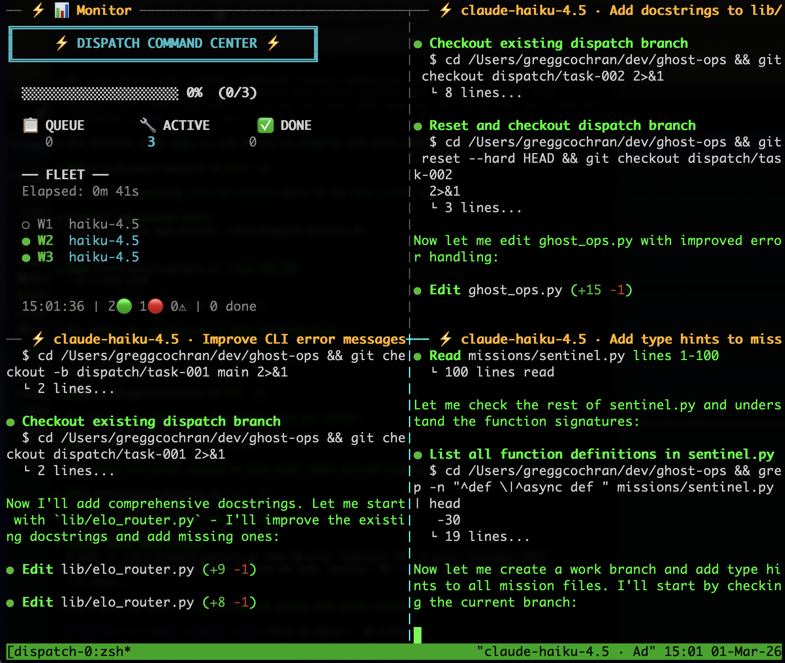

# 🦬 Terminal Stampede

**One terminal. Eight AI agents. All running at the same time.**

You've been doing AI coding one task at a time. Ask, wait, ask again, wait again. Terminal Stampede splits your terminal into 8 panes, drops an AI agent into each one, and lets them all charge through your codebase simultaneously. Each agent gets its own brain, its own branch, its own mission. You watch them work in real time through the gold ⚡ borders. Minutes later, everything's done.

📝 **[Read the full story →](BLOG.md)** *"I Split One Terminal Into 8 AI Brains. Here's What Happened."* — How Havoc Hackathon, Shadow Score, Dark Factory, and Agent X-Ray led to this experiment.

---


*Monitor pane tracking fleet progress, workers editing code in parallel*

> ⚡ **Get started fast!**
> ```bash
> git clone https://github.com/DUBSOpenHub/terminal-stampede.git
> cd terminal-stampede && chmod +x install.sh && ./install.sh
> ```

---

## 💡 The Problem

You're a developer. Monday morning. Your codebase needs error handling added to 4 modules, test coverage expanded, docs updated, and the CLI cleaned up. That's 8 tasks.

Today, you work through them one at a time. Ask Copilot for the first task. Wait. Ask for the second. Wait. Context-switch. Lose momentum. Some tasks take a minute, some take ten, but you're stuck in a queue of your own making.

Terminal Stampede runs them all at once. One command, eight panes, eight agents working in parallel on their own git branches. Instead of feeding tasks one by one, you define the batch and let them run. Your development time scales with the longest single task, not the sum of all of them.

| | Sequential | Parallel (Stampede) |
|---|---|---|
| Workflow | One task at a time | All tasks at once |
| Context windows | 200K tokens (shared) | 1.6M tokens (8 × 200K) |
| Git branches | 1 (sequential) | 8 (parallel, isolated) |
| Your involvement | Babysit each task | Start it and walk away |

---

## 🤔 What Is This?

Every multi-agent framework out there (LangGraph, CrewAI, AutoGen) runs agents as function calls inside one process. They share one brain. When Agent A is thinking, Agent B waits.

Terminal Stampede does something different. Each agent is a fully independent [Copilot CLI](https://docs.github.com/copilot/concepts/agents/about-copilot-cli) session running in its own tmux pane with its own 200K token context. It can read code, edit files, run tests, see failures, and fix them. No other agent is competing for its attention.

The "message queue" is just files on disk. The "orchestrator" is just a Copilot skill. The "agent runtime" is just your terminal. Point it at any repo.

---

## 🚀 Quick Start

### Prerequisites

- macOS or Linux
- `tmux` (`brew install tmux`)
- `gh copilot` (GitHub Copilot CLI extension)
- `python3`, `jq`, `openssl`, `git`

### Install

```bash
git clone https://github.com/DUBSOpenHub/terminal-stampede.git
cd terminal-stampede
chmod +x install.sh && ./install.sh
```

Three files land in their working locations:

| File | Location | Purpose |
|------|----------|---------|
| Orchestrator skill | `~/.copilot/skills/stampede/SKILL.md` | Parses commands, generates tasks, monitors, synthesizes |
| Worker agent | `~/.copilot/agents/stampede-worker.agent.md` | Claims tasks, does the work, writes results |
| Launcher | `~/bin/stampede.sh` | Creates tmux session, spawns panes, tracks PIDs |

### Run

```bash
stampede.sh --run-id run-20260301-120000 --count 8 --repo ~/your-project --model claude-haiku-4.5
```

A Terminal window opens. Eight panes tile across the screen. Gold ⚡ borders show the model and task for each agent. A monitor pane tracks progress in real time. You watch them work.

---

## 🗺️ How It Works

Think of a deli counter. Tasks are tickets on the wall. Agents grab one at a time.

### Task claiming (race-safe)

```
Agent A: mv queue/task-001.json claimed/task-001.json  ← succeeds
Agent B: mv queue/task-001.json claimed/task-001.json  ← file gone, tries next
```

No locks. No database. Just filesystem rename — atomic by POSIX guarantee.

### Each agent works alone

1. Claim a task (atomic `mv`)
2. Create git branch: `stampede/task-001`
3. Read the code, make improvements, run tests
4. Write result file (atomic: `.tmp-` then `mv`)
5. Claim next task or exit

### The orchestrator watches

```
⚙️ [████████████████░░░░] 75% (6/8) | alive=8 dead=0
```

If an agent dies mid-task, the orchestrator detects it via PID check, re-queues the task, and another agent picks it up.

### Conflict detection

When all results are in, the orchestrator checks if any two agents modified the same file:

```
⚠️ CONFLICT: lib/state.py modified by task-001 and task-003
✅ No conflicts on remaining 6 branches — ready to merge
```

---

## 🏇 Usage

```
stampede.sh --run-id <id> --count <n> --repo <path> [--model <model>]
stampede.sh --teardown --run-id <id>

Options:
  --run-id      Run identifier (format: run-YYYYMMDD-HHMMSS)
  --count       Number of agents (1-20, sweet spot: 6-8)
  --repo        Path to any git repository
  --model       AI model (default: claude-haiku-4.5)
  --teardown    Kill agents, clean up
  --no-attach   Don't auto-open Terminal window
```

## 🎮 Tmux Navigation

| Key | What it does |
|-----|-------------|
| `tmux attach -t stampede-{run_id}` | Attach to the fleet |
| `Ctrl-B z` | Zoom one pane full screen |
| `Ctrl-B z` again | Zoom back out to the grid |
| `Ctrl-B arrow` | Move between panes |
| `Ctrl-B d` | Detach (agents keep running) |

---

## 🏗️ Architecture

```
┌─────────────────────────────────────────────────┐
│  Orchestrator (SKILL.md)                        │
│  Parses intent → generates tasks → launches     │
│  workers → polls results → synthesizes          │
└───────────┬─────────────────────────────────────┘
            │
            ▼
┌─────────────────────────────────────────────────┐
│  Launcher (stampede.sh)                         │
│  tmux session → N panes → PID tracking          │
└───────┬───────┬───────┬───────┬─────────────────┘
        ▼       ▼       ▼       ▼
     ┌─────┐┌─────┐┌─────┐┌─────┐
     │  ⚡  ││  ⚡  ││  ⚡  ││  ⚡  │  Each agent: own terminal,
     │     ││     ││     ││     │  own 200K context, own branch
     └──┬──┘└──┬──┘└──┬──┘└──┬──┘
        │      │      │      │
        ▼      ▼      ▼      ▼
   ┌─────────────────────────────────┐
   │  ~/.copilot/stampede/{run_id}/  │
   │  queue/ → claimed/ → results/  │
   └─────────────────────────────────┘
```

**Zero infrastructure.** No Redis, no HTTP, no Docker, no cloud. Just files on disk and tmux.

## 🧠 Design Decisions

| Decision | Why |
|----------|-----|
| Filesystem as message queue | Simpler than anything else. `ls queue/` is your debugger |
| Agent for workers, skill for orchestrator | Skills load globally, agents load per-session. Clean role isolation |
| Branch per task | No two agents touch main. Conflicts caught at synthesis |
| 500-word result cap | 8 verbose summaries would blow the orchestrator's context |
| `--max-autopilot-continues 30` | Prevents runaway agents from burning unlimited quota |
| Lightweight models for grunt work | Save the powerful model for synthesis, use fast ones for parallel tasks |

---

## 🦬 Origin

Built during [Havoc Hackathon #37](https://github.com/DUBSOpenHub/havoc-hackathon), where 8 AI models competed to design this framework across 2 elimination rounds with sealed judging. The winning architecture was synthesized from Claude Opus 4.6 (Fast) and GPT-5.3-Codex, then battle-tested with live stampedes on real codebases.

**Read the full story:** [I Split One Terminal Into 8 AI Brains. Here's What Happened. →](BLOG.md)

## 📄 License

[MIT](LICENSE) — use it, fork it, stampede with it. 🦬

---

## 🐙 Built with Love

Created with 💜 by [DUBSOpenHub](https://github.com/DUBSOpenHub) to help more people discover the joy of GitHub Copilot CLI.

**Let's build!** 🚀✨
