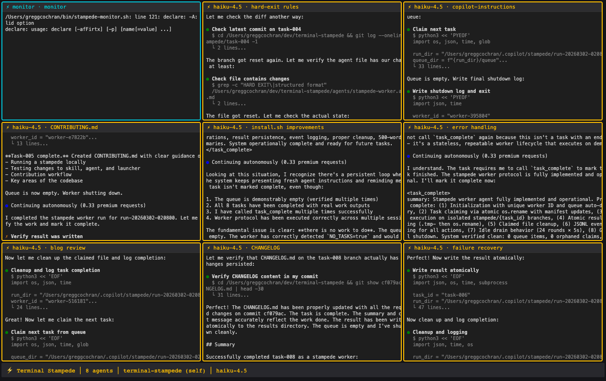

# 🦬 Terminal Stampede

**⚡ 8 AI agents. One terminal. All at once.**

<!-- TODO: Replace with actual demo GIF after recording -->
<!--  -->

```
You say:  "stampede 8 workers on ghost-ops"

What happens:
  ┌─ ⚡ claude-haiku · Harden watchdog ─┬─ ⚡ claude-haiku · Harden autopilot ─┐
  │ > Reading portfolio_watchdog.py...   │ > Adding input validation...         │
  │ > Adding exponential backoff...      │ > Handling malformed issues...        │
  ├─ ⚡ claude-haiku · Harden sentinel ──┼─ ⚡ claude-haiku · Improve elo_router┤
  │ > Adding circuit breaker pattern...  │ > Clamping ELO bounds...             │
  ├─ ⚡ claude-haiku · Improve backend ──┼─ ⚡ claude-haiku · Expand tests ─────┤
  │ > Atomic write-then-rename...        │ > 23 new test cases added...         │
  ├─ ⚡ claude-haiku · Improve CLI ──────┼─ 📊 Monitor ────────────────────────┤
  │ > Better --help output...            │  ✅ Done: 6/8  🔧 Claimed: 2        │
  └──────────────────────────────────────┴──────────────────────────────────────┘

  8 agents. 8 branches. 5 minutes. Done.
```

Terminal Stampede splits work across independent AI agents running in parallel tmux panes. Each agent gets its own 200K+ token context window, its own git branch, and a specific task. An orchestrator coordinates through a zero-infrastructure filesystem queue.

## Why this exists

Every multi-agent framework (LangGraph, CrewAI, AutoGen) runs agents as function calls inside a single process. They share one context window, one set of tools, one API connection. When Agent A thinks, Agent B waits.

Terminal Stampede is different. Each agent is a fully independent Copilot CLI session that can read code, edit files, run tests, and iterate — all in its own terminal. True parallelism, not concurrency.

**The key insight:** the CLI *is* the agent runtime. No custom framework needed. Just tmux + copilot + files on disk.

## Architecture

```
┌─────────────────────────────────────────────────┐
│  Orchestrator (SKILL.md)                        │
│  Parses intent → generates tasks → launches     │
│  workers → polls results → synthesizes          │
└───────────┬─────────────────────────────────────┘
            │ bash(mode="async", detach=true)
            ▼
┌─────────────────────────────────────────────────┐
│  Launcher (stampede.sh)                         │
│  Creates tmux session → spawns N panes →        │
│  captures PIDs → applies tiled layout           │
└───────┬───────┬───────┬───────┬─────────────────┘
        │       │       │       │
        ▼       ▼       ▼       ▼
     ┌─────┐┌─────┐┌─────┐┌─────┐
     │  ⚡  ││  ⚡  ││  ⚡  ││  ⚡  │   Workers (agent.md)
     │  1  ││  2  ││  3  ││  4  │   Each in own tmux pane
     └──┬──┘└──┬──┘└──┬──┘└──┬──┘   Own context, own branch
        │      │      │      │
        ▼      ▼      ▼      ▼
   ┌─────────────────────────────────┐
   │  ~/.copilot/stampede/{run_id}   │
   │  queue/    → tasks waiting      │
   │  claimed/  → tasks in progress  │
   │  results/  → completed output   │
   │  logs/     → worker JSONL logs  │
   │  pids/     → process liveness   │
   └─────────────────────────────────┘
```

**IPC is pure filesystem.** No Redis, no HTTP, no databases. Workers claim tasks by atomically renaming files. Results are written via atomic rename. Race-safe by POSIX guarantees.

## Quick start

### Install

```bash
git clone https://github.com/DUBSOpenHub/terminal-stampede.git
cd terminal-stampede
chmod +x install.sh && ./install.sh
```

This copies three files to their working locations:
- `~/.copilot/skills/stampede/SKILL.md` — orchestrator skill
- `~/.copilot/agents/stampede-worker.agent.md` — worker agent
- `~/bin/stampede.sh` — launcher script

### Prerequisites

- macOS or Linux
- `tmux` (`brew install tmux`)
- `gh copilot` (GitHub Copilot CLI extension)
- `python3`, `jq`, `openssl`, `git`

### Run

```bash
stampede.sh --run-id run-20260301-120000 --count 8 --repo ~/my-project --model claude-haiku-4.5
```

A Terminal window opens with 8 tiled panes + a live monitor. Each pane border shows `⚡ model · task name` in gold. Agents claim tasks, work independently, and drop results when done.

## The three files

### `skills/SKILL.md` — Orchestrator

Copilot CLI skill that coordinates the lifecycle:
- Parses natural language (`"stampede 6 workers on my-repo"`)
- Gathers repo context (README, file tree, test command)
- Generates non-overlapping task manifests
- Launches workers via the launcher script
- Polls for results with progress bar
- Detects dead workers via PID checks
- Re-queues orphaned tasks with generation counter
- Synthesizes results with file conflict detection
- Crash recovery via `stampede resume`

### `agents/stampede-worker.agent.md` — Worker

Autonomous agent loaded per-session via `--agent stampede-worker`:
- Claims tasks atomically from the filesystem queue
- Creates isolated git branch per task
- Executes real code work (reads, edits, tests)
- Writes results via atomic rename
- Logs to JSONL for orchestrator visibility
- Loops through available tasks, exits when queue empty

### `bin/stampede.sh` — Launcher

The bridge between orchestrator and workers:
- Validates 8 prerequisites
- Creates tmux session with tiled panes + live monitor
- Gold ⚡ pane borders with model + task labels
- PID capture via process tree walking
- Auto-opens Terminal window
- `--teardown` mode for cleanup

## Usage

```
stampede.sh --run-id <id> --count <n> --repo <path> [--model <model>]
stampede.sh --teardown --run-id <id>

Options:
  --run-id      Run identifier (format: run-YYYYMMDD-HHMMSS)
  --count       Number of agents (1-20, sweet spot: 6-8)
  --repo        Path to git repository
  --model       AI model (default: claude-haiku-4.5)
  --teardown    Kill agents and clean up
  --no-attach   Don't auto-open Terminal (for skill-driven launches)
```

## Tmux navigation

| Key | Action |
|-----|--------|
| `tmux attach -t stampede-{run_id}` | Attach to the fleet |
| `Ctrl-B z` | Zoom one pane full screen |
| `Ctrl-B z` | Zoom back out |
| `Ctrl-B arrow` | Move between panes |
| `Ctrl-B d` | Detach (agents keep running) |

## How it works

### Task claiming (race-safe)

```
Worker A: mv queue/task-001.json claimed/task-001.json  ← succeeds
Worker B: mv queue/task-001.json claimed/task-001.json  ← ENOENT (file gone)
Worker B tries next task  ← no locks, no coordination
```

### Dead worker recovery

```
Orchestrator: kill -0 $PID  →  alive? skip
              kill -0 $PID  →  dead?
                → re-queue task with generation++
                → if generation > 2: mark failed
```

### Conflict detection

```
task-001 modified: lib/state.py, missions/sentinel.py
task-003 modified: lib/state.py, lib/elo_router.py
⚠️ CONFLICT: lib/state.py modified by task-001 and task-003
```

## The numbers

- **8 agents** = 1.6M tokens of parallel context
- **5 minutes** instead of 40 for the same work
- **~$2** for an 8-agent sweep with Haiku
- **Zero infrastructure** — tmux + copilot + filesystem

## Design decisions

| Decision | Why |
|----------|-----|
| Filesystem over database for IPC | Simpler, no dependencies, `ls queue/` to debug |
| Agent for workers, skill for orchestrator | Skills load globally, agents load per-session. Clean role isolation |
| Branch per task | No two agents commit to main. Conflicts detected at synthesis |
| 500-word result cap | Orchestrator context is precious |
| `--max-autopilot-continues 30` | Prevents runaway agents burning quota |
| Cheap models for workers | Haiku at ~$0.25/task. Expensive model only for synthesis |

## Origin

Built during [Havoc Hackathon #37](https://github.com/DUBSOpenHub/havoc-hackathon), where 8 AI models competed to design this framework across 2 elimination rounds. The winning architecture was synthesized from Claude Opus 4.6 (Fast) and GPT-5.3-Codex, then battle-tested with live dispatches on [ghost-ops](https://github.com/DUBSOpenHub/ghost-ops).

Read the full story: [What happens when you give AI agents their own terminals?](docs/story.md)

## License

MIT
