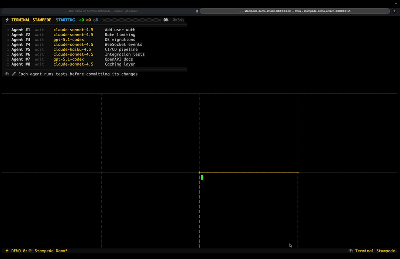

# 🦬 Terminal Stampede

> 🦬 **Try the demo — no setup required!**
> ```bash
> git clone https://github.com/DUBSOpenHub/terminal-stampede.git
> cd terminal-stampede && ./install.sh
> ```
> Zero API calls. Just `tmux` and `bash`. See agents work in real time.
>
> 


<p align="center">
  
</p>

**A parallel agent runtime for your terminal.** Run up to 20 AI coding agents simultaneously, each in its own tmux pane with its own context window and git branch. Works with any CLI agent that can take a prompt and write code.

- 🏠 **Zero-infrastructure local swarm**
- 🖥️ **tmux as execution surface**
- 📂 **Filesystem as atomic message bus**
- 👀 **Human-in-the-loop observability**
- 🧱 **Simplicity over complexity** — no frameworks, no servers, no message brokers. The simpler the system, the more reliable the output.
- 🎯 **[Shadow scoring](https://github.com/DUBSOpenHub/shadow-score-spec)** — quality defined before agents run, measured silently after

---

You've been doing AI coding one task at a time. Ask, wait, ask again, wait again. Terminal Stampede splits your terminal into multiple panes, drops an AI agent into each one, and lets them all charge through your codebase simultaneously. Each agent gets its own brain, its own branch, its own mission. You watch them work in real time through the gold ⚡ borders. Minutes later, everything's done.

**Zero infrastructure.** No Redis, no HTTP, no Docker, no cloud. Just files on disk and tmux.

**Human in the loop, not after the fact.** Every agent runs in a visible pane. Zoom in on any one, type into it, kill it, or just watch. Most multi-agent systems give you logs when it's over. This one puts you in the room while it's happening.

**tmux is the runtime.** Each pane is a full CLI agent session with its own context window. The filesystem is the message bus — task claiming is an atomic file rename, no locks, no coordination server. Point it at any repo.

**Works with any CLI agent.** Built with GitHub Copilot CLI, but the pattern is tool-agnostic — swap the agent command for Aider, Claude Code, or any CLI tool that can read a task and write code.

📝 **[Read the full story →](BLOG.md)** *"What If You Could Run 20 AI Agents in One Terminal?"* — How Havoc Hackathon, Shadow Score, Dark Factory, and Agent X-Ray led to this experiment.

---

## 🚀 Quick Start

### Prerequisites

- macOS or Linux
- `tmux` (`brew install tmux`)
- A CLI coding agent (e.g., [GitHub Copilot CLI](https://docs.github.com/copilot/concepts/agents/about-copilot-cli), Aider, Claude Code)
- `python3`, `jq`, `openssl`, `git`

### Install

```bash
git clone https://github.com/DUBSOpenHub/terminal-stampede.git
cd terminal-stampede
chmod +x install.sh && ./install.sh
```

Three files land in their working locations:

| File | Location | Purpose |
|------|----------|---------|
| Orchestrator skill | `~/.copilot/skills/stampede/SKILL.md` | Parses commands, generates tasks, monitors, synthesizes |
| Worker agent | `~/.copilot/agents/stampede-worker.agent.md` | Claims tasks, does the work, writes results |
| Merger agent | `~/.copilot/agents/stampede-merger.agent.md` | Auto-merges all branches, resolves conflicts, shadow-scores |
| Launcher | `~/bin/stampede.sh` | Creates tmux session, spawns panes, tracks PIDs |
| Monitor | `~/bin/stampede-monitor.sh` | Live progress, stuck detection, runtime stats |
| Merger script | `~/bin/stampede-merge.sh` | Discovers branches, sorts by size, launches merger |

### Run

**Option A: From a Copilot CLI session** (if using GitHub Copilot)

Open a Copilot CLI session and tell the stampede skill what to do:

```
stampede 8 agents on ~/my-project — add error handling, write tests, improve docs
```

The orchestrator reads your codebase, generates task files, launches the fleet, and monitors progress. You watch.

**Option B: From the command line** (full control)

Create task files yourself, then launch:

```bash
# 1. Create a run directory (inside your repo)
cd ~/my-project
RUN_ID="run-$(date +%Y%m%d-%H%M%S)"
mkdir -p .stampede/$RUN_ID/{queue,claimed,results,logs}

# 2. Add task files (one JSON per task)
cat > .stampede/$RUN_ID/queue/task-001.json << 'EOF'
{
  "task_id": "task-001",
  "description": "Add input validation to the auth module",
  "scope": ["src/auth.py"],
  "branch": "stampede/task-001"
}
EOF
# ... repeat for each task

# 3. Launch the fleet
stampede.sh --run-id $RUN_ID --count 8 --repo ~/my-project --model claude-haiku-4.5
```

A Terminal window opens. Eight panes tile across the screen. Gold ⚡ borders show the model and task for each agent. A monitor pane tracks progress in real time. You watch them work.

---

## 📊 We Pointed It at Itself

To test Terminal Stampede, we pointed it at this repo. 8 agents ran simultaneously on the terminal-stampede codebase — adding error handling, creating docs, improving the agent prompts, updating the changelog, and more. Nobody touched anything. They just ran.

| | Result |
|---|---|
| Tasks | 8 |
| Agents | 8 (claude-haiku-4.5) |
| Wall clock | ~6 minutes |
| Success rate | 8/8 |
| Coordination failures | 0 |

| Task | Changes |
|------|---------|
| Defensive error handling for stampede.sh | +218 -33 |
| CONTRIBUTING.md (from scratch) | +219 |
| Agent hard-exit rules | +218 -33 |
| Orchestrator failure recovery docs | +132 -1 |
| CHANGELOG update from git history | +100 |
| copilot-instructions.md improvements | +85 -3 |
| Blog accuracy review | +30 -30 |
| Install.sh: uninstall, --check, versioning | +100 |

8 branches. ~800 lines of real changes. The simplest possible architecture — files on disk, atomic renames, no coordination server — was also the most reliable. Nothing broke. Nothing conflicted. The agents didn't even know each other existed.

---

## 💡 The Problem

You're a developer. Monday morning. Your codebase needs error handling added to 4 modules, test coverage expanded, docs updated, and the CLI cleaned up. That's 8 tasks.

Today, you work through them one at a time. Ask your AI agent for the first task. Wait. Ask for the second. Wait. Context-switch. Lose momentum. Some tasks take a minute, some take ten, but you're stuck in a queue of your own making.

Terminal Stampede runs them all at once. One command, up to 20 panes, each agent working in parallel on its own git branch. Instead of feeding tasks one by one, you define the batch and let them run. Your development time scales with the longest single task, not the sum of all of them.

| | Sequential | Parallel (Stampede) |
|---|---|---|
| Workflow | One task at a time | All tasks at once |
| Context windows | One shared session | Up to 20 independent sessions |
| Git branches | 1 (sequential) | Up to 20 (parallel, isolated) |
| Your involvement | Babysit each task | Start it and walk away |

---

## 🤔 What Is This?

Every multi-agent framework out there (LangGraph, CrewAI, AutoGen) runs agents as function calls inside one process. They share one brain. When Agent A is thinking, Agent B waits.

Terminal Stampede does something different. Each agent is a fully independent CLI session running in its own tmux pane with its own context window. It can read code, edit files, run tests, see failures, and fix them. No other agent is competing for its attention.

The "message queue" is just files on disk. The "orchestrator" is just a script. The "agent runtime" is just your terminal. Point it at any repo.

---

---

## 🗺️ How It Works

Think of a deli counter. Tasks are tickets on the wall. Agents grab one at a time.

### Task claiming (race-safe)

```
Agent A: mv queue/task-001.json claimed/task-001.json  ← succeeds
Agent B: mv queue/task-001.json claimed/task-001.json  ← file gone, tries next
```

No locks. No database. Just filesystem rename — atomic by POSIX guarantee.

### Each agent works alone

1. Claim a task (atomic `mv`)
2. Create git branch: `stampede/task-001`
3. Read the code, make improvements, run tests
4. Write result file (atomic: `.tmp-` then `mv`)
5. Claim next task or exit

### The orchestrator watches

```
⚙️ [████████████████░░░░] 75% (6/8) | alive=8 dead=0
```

If an agent dies mid-task, the orchestrator detects it via PID check, re-queues the task, and another agent picks it up.

### Conflict detection

When all results are in, the orchestrator checks if any two agents modified the same file:

```
⚠️ CONFLICT: lib/state.py modified by task-001 and task-003
✅ No conflicts on remaining 6 branches — ready to merge
```

### Auto-merge with shadow scoring

> **"Did you define what good looks like before AI ran, or after?"**
> Most people using AI coding tools have no definition of quality — they eyeball the output and hope for the best. Stampede bakes evaluation into the runtime itself. The scoring criteria are defined before agents run. Measurement happens silently during and after. The agents never know they're being scored.

After all agents finish, the merger agent combines every branch into one. It merges sequentially (smallest changes first to build a clean base), resolves conflicts using AI that reads both task descriptions to understand intent, and skips anything irreconcilable.

While merging, the merger silently **shadow-scores** each agent's work across 3 layers:

| Layer | When | What It Measures |
|-------|------|-----------------|
| Runtime | During stampede | Time to complete, stuck events, files changed |
| Merge | During merge | Conflict friendliness (clean merge vs. conflicts caused) |
| Quality | After all merges | Completeness, scope adherence, code quality, test impact |

Scores are weighted — Completeness (30%) matters most, Conflict Friendliness (10%) matters least since it's partly outside the agent's control. The agents never know they're being scored.

```
🦬 Shadow Scorecard (weighted)
═══════════════════════════════════════════════════════════════════════════
 Agent       Model              Comp  Scope  Qual  Conflt  Test   Total  +/-
                                (30%)  (25%) (20%)  (10%) (15%)   /50
 ─────────────────────────────────────────────────────────────────────────
 task-001    claude-sonnet-4.5    10     10     8     10     5    44.2  ⚡+2
 task-002    gpt-5.1              10     10     8     10     5    44.2
 task-003    claude-sonnet-4.5    10     10     8     10     5    44.2  🐌-1
═══════════════════════════════════════════════════════════════════════════
```

Scores persist across runs to `~/.copilot/stampede-model-stats.json`, building a leaderboard that shows which AI models consistently produce the best work over time.

### Which AI model is actually best for your codebase?

Every vendor publishes benchmarks. Every benchmark uses synthetic tests. None of them tell you which model writes the best code *on your repo, with your patterns, in your language*.

The stampede leaderboard answers that question empirically. Every run shadow-scores each model's work. Scores accumulate across runs. Over time, you get a ranking built from real work on your real codebase — not from HumanEval, not from vendor marketing, not from someone else's synthetic tests. From your code, your tasks, your results.

```
📊 Model Leaderboard (12 runs)
─────────────────────────────────────────────────────
  claude-sonnet-4.5         avg 44.2/50  (18 branches)
  gpt-5.1-codex             avg 42.8/50  (14 branches)
  claude-haiku-4.5          avg 41.1/50  (22 branches)
  gpt-5.1                   avg 39.7/50  (16 branches)
  gemini-3-pro              avg 38.4/50  (10 branches)

📈 Model stats updated (12 total runs)
```

---

## 🏇 Usage

```
stampede.sh --run-id <id> --count <n> --repo <path> [--model <model>]
stampede.sh --teardown --run-id <id>

Options:
  --run-id      Run identifier (format: run-YYYYMMDD-HHMMSS)
  --count       Number of agents (1-20, sweet spot: 6-8)
  --repo        Path to any git repository
  --model       AI model (default: claude-haiku-4.5)
  --teardown    Kill agents, clean up
  --no-attach   Don't auto-open Terminal window
```

## 🎮 Tmux Navigation

| Key | What it does |
|-----|-------------|
| `tmux attach -t stampede-{run_id}` | Attach to the fleet |
| `Ctrl-B z` | Zoom one pane full screen |
| `Ctrl-B z` again | Zoom back out to the grid |
| `Ctrl-B arrow` | Move between panes |
| `Ctrl-B d` | Detach (agents keep running) |

> 💬 **Zoom into any pane and talk to the agent mid-task.** Every pane is a live session — watch, redirect, or course-correct while the stampede runs.

> 🖥️ **Best on ultrawide.** 20 agents on a 49" ultrawide gives each one the space of a normal terminal. One monitor, 20 AI brains, all visible at once.

---

## 🏗️ Architecture

```
┌─────────────────────────────────────────────────┐
│  Orchestrator (SKILL.md)                        │
│  Parses intent → generates tasks → launches     │
│  agents → polls results → synthesizes           │
└───────────┬─────────────────────────────────────┘
            │
            ▼
┌─────────────────────────────────────────────────┐
│  Launcher (stampede.sh)                         │
│  tmux session → N panes → PID tracking          │
└───────┬───────┬───────┬───────┬─────────────────┘
        ▼       ▼       ▼       ▼
     ┌─────┐┌─────┐┌─────┐┌─────┐
     │  🦬  ││  🦬  ││  🦬  ││  🦬  │  Each agent: own terminal,
     │     ││     ││     ││     │  own context window, own branch
     └──┬──┘└──┬──┘└──┬──┘└──┬──┘
        │      │      │      │
        ▼      ▼      ▼      ▼
   ┌─────────────────────────────────┐
   │  repo/.stampede/{run_id}/       │
   │  queue/ → claimed/ → results/  │
   │                                 │
   └───────────────┬─────────────────┘
                   │ all done
                   ▼
   ┌─────────────────────────────────┐
   │  Merger (stampede-merger)       │
   │  Auto-merge → resolve conflicts│
   │  → shadow score → leaderboard  │
   └─────────────────────────────────┘
```

## 🧠 Design Decisions

| Decision | Why |
|----------|-----|
| Filesystem as message queue | Simpler than anything else. `ls queue/` is your debugger |
| Agents for tasks, skill for orchestrator | Skills load globally, agents load per-session. Clean role isolation |
| Branch per task | No two agents touch main. Conflicts caught at synthesis |
| Auto-merger with AI conflict resolution | Reads both task descriptions to resolve conflicts semantically, not just syntactically |
| Weighted shadow scoring | Completeness (30%) matters most; conflict friendliness (10%) is partly luck |
| Cross-run model leaderboard | Shows which AI models consistently produce the best work over time |
| 500-word result cap | Verbose summaries would blow the orchestrator's context |
| `--max-autopilot-continues 30` | Prevents runaway agents from burning unlimited quota |
| Lightweight models for grunt work | Save the powerful model for synthesis, use fast ones for parallel tasks |

---

## 🦬 Origin

Built during a [Havoc Hackathon](https://github.com/DUBSOpenHub/havoc-hackathon), where AI models competed to design this framework across elimination rounds with sealed judging. The winning architecture was synthesized from Claude Opus 4.6 (Fast) and GPT-5.3-Codex, then battle-tested with live stampedes on real codebases.

**Read the full story:** [I Split One Terminal Into 20 AI Brains. Here's What Happened. →](BLOG.md)

## 📄 License

[MIT](LICENSE) — use it, fork it, stampede with it. 🦬

---

## 🐙 Built with Love

Created with 💜 by [DUBSOpenHub](https://github.com/DUBSOpenHub). Works with any CLI coding agent.

**Let's build!** 🚀✨
